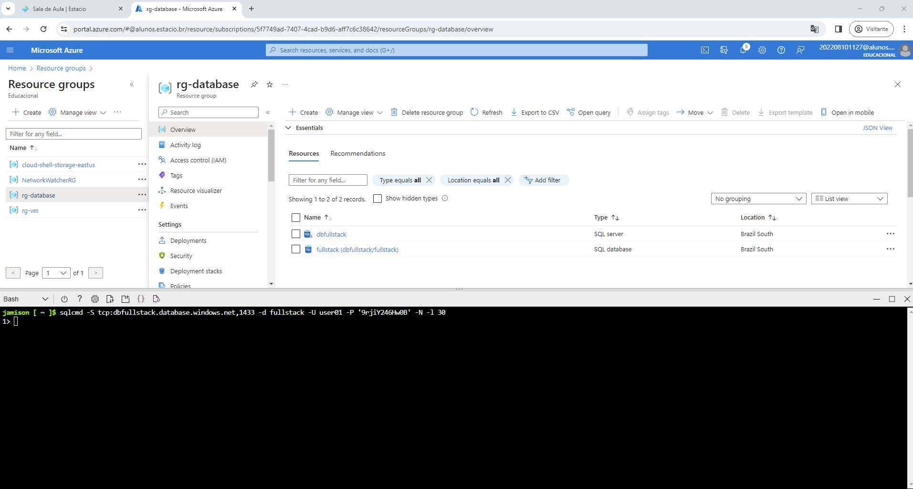
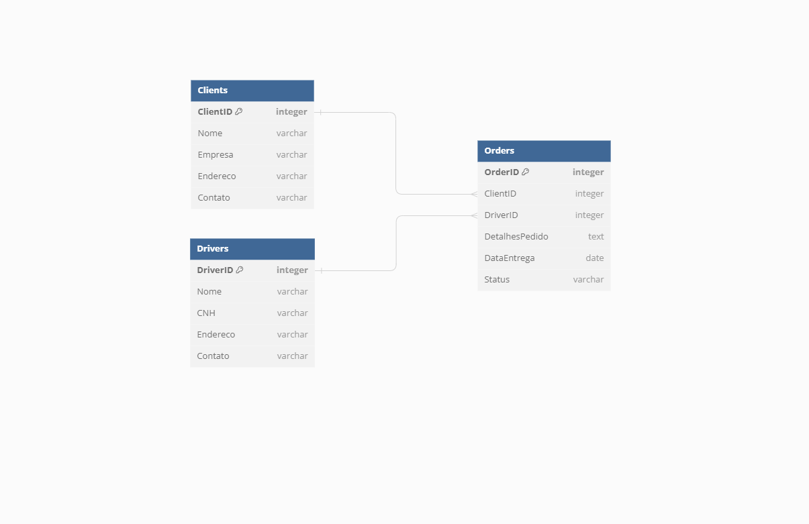
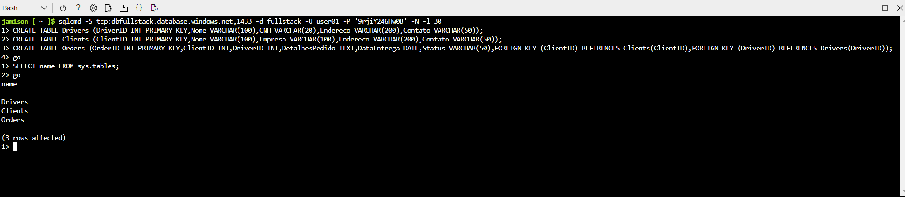
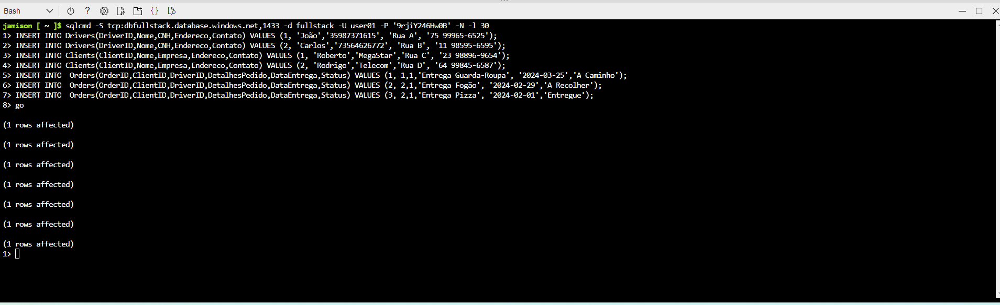
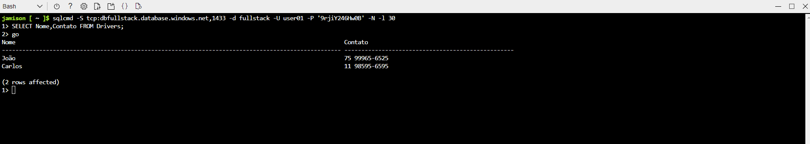
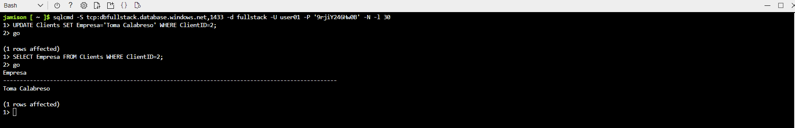
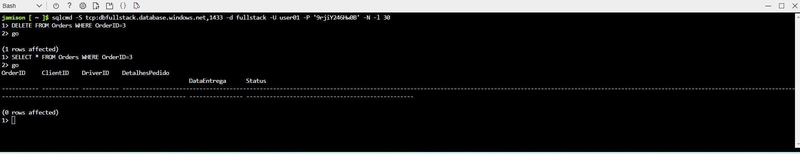

## Projeto SQL Server no Azure

O objetivo deste projeto é estabelecer um banco de dados no Microsoft Azure utilizando SQL Server e implementar as operações fundamentais de CRUD (Create, Read, Update e Delete).

## Recursos

- Conta no Azure; 
- Navegador Web: Google Chrome, Firefox, MS Edge, Safari ou Opera;
- Versionado através do Git / Github; 

## Configuração Inicial
Nesta etapa, foi realizado o acesso à conta no Azure, configurando adequadamente os recursos e obtendo acesso ao banco de dados criado.

## Modelo de Entidade Relacional
Modelo do ER utilizado nesse projeto.

## Criação das Tabelas

##  Comando Insert

##  Comando Select

##  Comando Update

##  Comando Delete

